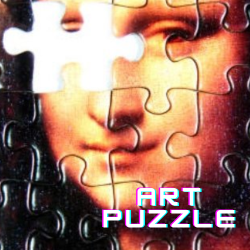
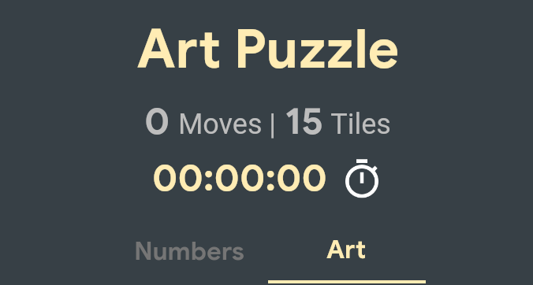

<div id="top"></div>

# Art Puzzle

A Art Puzzle built for [Flutter Challenge](https://flutterhack.devpost.com/).

*Built by Larbi Abatorab.


---


<!-- PROJECT LOGO -->
<br />
<div align="center">
  <a href="https://github.com/larbiii14/Art_Puzzle">
    
  </a>

<h3 align="center">Art_Puzzle</h3>

  <p align="center">
    project_description
    <br />
    <a href="https://github.com/larbiii14/Art_Puzzle"><strong>Explore the docs »</strong></a>
    <br />
    <br />
    <a href="https://github.com/larbiii14/Art_Puzzle">View Demo</a>
    ·
    <a href="https://github.com/larbiii14/Art_Puzzle/issues">Report Bug</a>
    ·
    <a href="https://github.com/larbiii14/Art_Puzzle/issues">Request Feature</a>
  </p>
</div>


<!-- TABLE OF CONTENTS -->
<details>
  <summary>Table of Contents</summary>
  <ol>
    <li>
      <a href="#about-the-project">About The Project</a>
      <ul>
        <li><a href="#built-with">Built With</a></li>
      </ul>
    </li>
    <li>
      <a href="#getting-started">Getting Started</a>
      <ul>
        <li><a href="#prerequisites">Prerequisites</a></li>
        <li><a href="#installation">Installation</a></li>
      </ul>
    </li>
    <li><a href="#usage">Usage</a></li>
    <li><a href="#roadmap">Roadmap</a></li>
    <li><a href="#contributing">Contributing</a></li>
    <li><a href="#license">License</a></li>
    <li><a href="#contact">Contact</a></li>
    <li><a href="#acknowledgments">Acknowledgments</a></li>
  </ol>
</details>


<!-- ABOUT THE PROJECT -->
## About The Project
<div align="center">
  <a href="https://github.com/larbiii14/Art_Puzzle">
    
  </a>
  <br />
[![Product Name Screen Shot][product-screenshot]](https://art-puzzle-1157.web.app/)

 `larbiii14`, `Art_puzzle`, `l-abatorab`, `larbiii14@gmail.com`, `Art_puzzle`, `A flutter Art Puzzle `

<p align="right">(<a href="#top">back to top</a>)</p>


### Built With

* [Flutter](https://flutter.dev/)
* [Dart](https://dart.dev/)


<p align="right">(<a href="#top">back to top</a>)</p>


<!-- GETTING STARTED -->
## Getting Started

To run the project either use the launch configuration in VSCode/Android Studio or use the following command:

```sh
$ flutter run -d chrome
```

### Prerequisites

What you'll use
You need two pieces of software to complete this lab: the Flutter SDK and an editor.  Android Studio, but you can use your preferred editor.

You can run this Flutter App by using any of the following devices:

A physical device (Android or iOS) connected to your computer and set to developer mode
The iOS simulator (requires installing Xcode tools)
The Android emulator (requires setup in Android Studio)
A browser (Chrome is required for debugging)
As a Windows, Linux, or macOS desktop application


<p align="right">(<a href="#top">back to top</a>)</p>


See the [open issues](https://github.com/larbiii14/Art_Puzzle/issues) for a full list of proposed features (and known issues).

<p align="right">(<a href="#top">back to top</a>)</p>


<!-- CONTRIBUTING -->
## Contributing

Contributions are what make the open source community such an amazing place to learn, inspire, and create. Any contributions you make are **greatly appreciated**.

If you have a suggestion that would make this better, please fork the repo and create a pull request. You can also simply open an issue with the tag "enhancement".
Don't forget to give the project a star! Thanks again!

1. Fork the Project
2. Create your Feature Branch (`git checkout -b feature/AmazingFeature`)
3. Commit your Changes (`git commit -m 'Add some AmazingFeature'`)
4. Push to the Branch (`git push origin feature/AmazingFeature`)
5. Open a Pull Request

<p align="right">(<a href="#top">back to top</a>)</p>


<!-- LICENSE -->
## License

Distributed under the MIT License. See `LICENSE.txt` for more information.

<p align="right">(<a href="#top">back to top</a>)</p>


<!-- CONTACT -->
## Contact

LARBI ABATORAB - [@larbi_abatorab](https://twitter.com/larbi_abatorab) - larbiii14@gmail.com

Project Link: [https://github.com/larbiii14/Art_Puzzle](https://github.com/larbiii14/Art_Puzzle)

<p align="right">(<a href="#top">back to top</a>)</p>


<!-- MARKDOWN LINKS & IMAGES -->

[contributors-shield]: https://img.shields.io/github/contributors/larbiii14/Art_Puzzle.svg?style=for-the-badge
[contributors-url]: https://github.com/larbiii14/Art_Puzzle/graphs/contributors
[forks-shield]: https://img.shields.io/github/forks/larbiii14/Art_Puzzle.svg?style=for-the-badge
[forks-url]: https://github.com/larbiii14/Art_Puzzle/network/members
[stars-shield]: https://img.shields.io/github/stars/larbiii14/Art_Puzzle.svg?style=for-the-badge
[stars-url]: https://github.com/larbiii14/Art_Puzzle/stargazers
[issues-shield]: https://img.shields.io/github/issues/larbiii14/Art_Puzzle.svg?style=for-the-badge
[issues-url]: https://github.com/larbiii14/Art_Puzzle/issues
[license-shield]: https://img.shields.io/github/license/larbiii14/Art_puzzle.svg?style=for-the-badge
[license-url]: https://github.com/larbiii14/Art_Puzzle/blob/master/LICENSE.txt
[linkedin-shield]: https://img.shields.io/badge/-LinkedIn-black.svg?style=for-the-badge&logo=linkedin&colorB=555
[linkedin-url]: https://linkedin.com/in/l-abatorab
[product-screenshot]: images/screenshot.png
